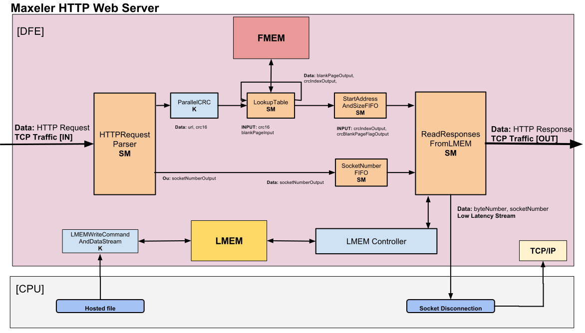
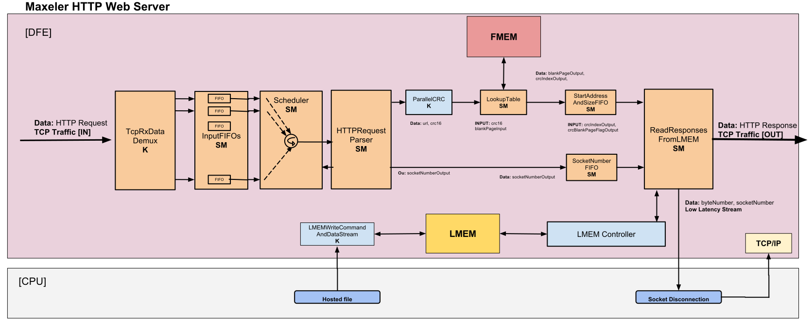

# HTTP Web-Server

### Description
This App implements an HTTP Web-Server in a DFE. The App serves static webpages directly from LMEM, routes uncached requests to servers on the network (acting as a reverse proxy) [TBD] and acts as a user programmable load balancer [TBD]. The DFE-based web-server has better throughput (number of requests served) and lower latency compared to software web-servers.

HTTP Web-Server on [AppGallery](http://appgallery.maxeler.com/)

#### Current architecture - Maxeler HTTP Server

#### Final architecture - Maxeler HTTP Server

